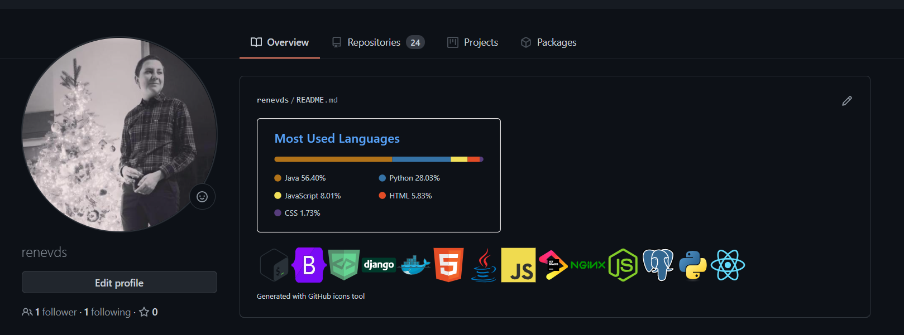

# github-profile-icons
Simple react app that let's you chose a set of icons from the [devicon](https://github.com/devicons/devicon) set and generates the markdown.   
Can be used on your profile or in any of your repos.

### Try it [here](https://renevds.github.io/language-icon-widget-pages/#/)!

### Example
